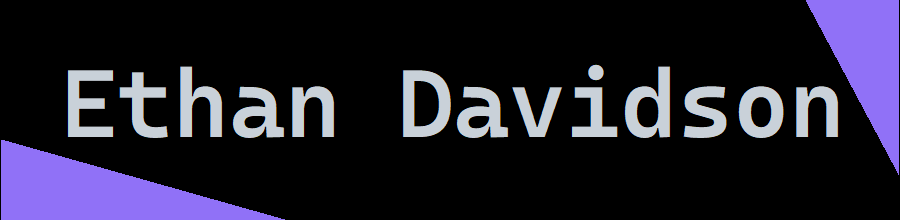

# Hi, I'm [Ethan](https://etok.me) 👋

🦄 Ex-[**@Google**](https://github.com/google) 🧪 Software Engineer leading
research [**@wazootech**](https://github.com/wazootech) 🦕 California

## Current projects

- 🧠 **[worlds](https://github.com/wazootech/worlds)** – Provides the
  infrastructure layer for neuro-symbolic memory
- 🔍 **[go-protocol](https://github.com/fartlabs/go)** – Defines an
  Internet-Draft for deterministic shortlink resolution
- 🌳 **[ts-derive](https://github.com/fartlabs/ts-derive)** – Derives TypeScript
  types and structures automatically
- 🗺️ **[sparql-agent](https://github.com/EthanThatOneKid/sparql-agent)** –
  Manages federated knowledge and SPARQL execution
- 🕵️ **[aml-agent](https://github.com/EthanThatOneKid/aml-agent)** – Automates
  AML compliance decisions with agentic reasoning
- 🛎️ **[concierge](https://github.com/EthanThatOneKid/concierge.snfforms.com)**
  – Powers a multi-agent conversational system for industrial printing
- 🔍 **[Difflint](https://github.com/EthanThatOneKid/difflint)** – Identifies
  linting errors surgically in high-compliance codebases
- 📈 **[TradingPings.com](https://tradingpings.com)** – Analyzes market signals
  with AI-driven trading alerts
- 🌎 **[pixel-planet](https://pixel-planet.fartlabs.org)** – Procedurally
  generates pixel art planets as a React component library

## Fun with JSX

- 🐉 **[jsonx](https://github.com/fartlabs/jsonx)** – Library that enables
  developers to build their own JSX runtimes
- 🛰️ **[rt/rtx](https://github.com/fartlabs/rt)** – JSX-powered routing for
  modern web ecosystems
- 📄 **[ht/htx](https://github.com/fartlabs/ht)** – Type-safe JSX-powered HTML
- 🧬 **[agx](https://github.com/fartlabs/agx)** – JSX-powered agentic workflows

> [!NOTE]
> I wrote a
> [documentation page to help developers understand JSX](https://jsonx.fart.tools/jsx).

## Legacy work

- 🎓 **[acmcsuf.com](https://acmcsuf.com)** – Orchestrated a community website
  serving 100+ contributors
- 💻 **[FullyHacks](https://fullyhacks.acmcsuf.com)** – Architected a flagship
  collegiate hackathon platform
- 🧊 **[Deno Blocks](https://blocks.deno.dev)** – Developed a no-code TypeScript
  platform recognized by Ryan Dahl
- 💰 **[RuFi](https://github.com/EthanThatOneKid/rufi)** – Enabled spare change
  donations via voice-enabled technology
- 🪐 **[nasa-worlds](https://ethanthatonekid.github.io/nasa-worlds/)** – Curated
  retro-futuristic illustrations for the NASA archive
- 🎨
  **[reddit-place-clone](https://github.com/EthanThatOneKid/reddit-place-clone)**
  – Engineered a real-time collaborative pixel canvas
- 🎭 **[Holosuite](https://holosuite.io)** – Created a simulation-sharing
  platform
- 🐈‍⬛ **[neo](https://github.com/EthanThatOneKid/neo-cli)** – Authored a
  web-automation scripting language interpreter
- 💩 **[fart](https://github.com/FartLabs/fart)** – Generated polyglot type
  definitions for cross-ecosystem interop

## GitHub activity

## What I'm doing

- **Building the AI-native Semantic Web** – Engineering knowledge infrastructure
  for next-generation intelligence.
- **Worlds at [Wazoo](https://wazoo.dev)** – Delivering neuro-symbolic world
  models and developer toolchains.
- **Rapid prototyping** – Launching production-ready applications in days, not
  months.
- **Build in public** – Open-sourcing experimental developer tools and fun
  projects via [FartLabs](https://fartlabs.org).

## Latest writings

- [FartLabs in 2025](https://fartlabs.org/2025)
- [FartLabs in 2024](https://fartlabs.org/2024)
- [FartHacks: Lessons Learned](https://fartlabs.org/hackathon/)
- [About FartLabs](https://fartlabs.org/mission)
- [Understanding JSX](https://jsonx.fart.tools/jsx)
- [Genuary Codelab](https://github.com/acmcsufoss/acmcsuf.com/discussions/742)
- [What is RSS?](https://github.com/acmcsufoss/acmcsuf.com/discussions/269)
- [My Discord Screen Name](https://github.com/EthanThatOneKid/ethan-print#readme)

## Connect

---

### Recognition

- Summer Google Software Engineer Intern @ Dataplex UI and Hotel Center
- Won "[Ryan Dahl](https://tinyclouds.org/)'s Favorite" @ Deno Subhosting
  Hackathon
- 1st Place @ HackSC 2024 (Anyone Protocol)

## Media

- **[AI & Community Building Interview](https://www.youtube.com/watch?v=f-B88GvQzSc)** -
  Guest appearance on Sachin Lodhi's podcast discussing the future of AI and web
  innovation.
- **[FartHacks 2025 Opening Ceremony](https://youtu.be/bbeME9BaSKs)** - Kickoff
  session for FartLabs' premier community hackathon.

## Random facts

- Certified in SCUBA diving at age 10 to be my dad's dive buddy 🫧
- Serial community builder & founder ([Wazoo](https://wazoo.dev),
  [FartLabs](https://fartlabs.org),
  [FullyHacks](https://fullyhacks.acmcsuf.com), [ACM CSUF](https://acmcsuf.com),
  [Vaqcoders](https://vaqcoders.github.io))
- My favorite Pokemon include Porygon, Farfetch'd, Togekiss, Greninja, and
  Typhlosion

